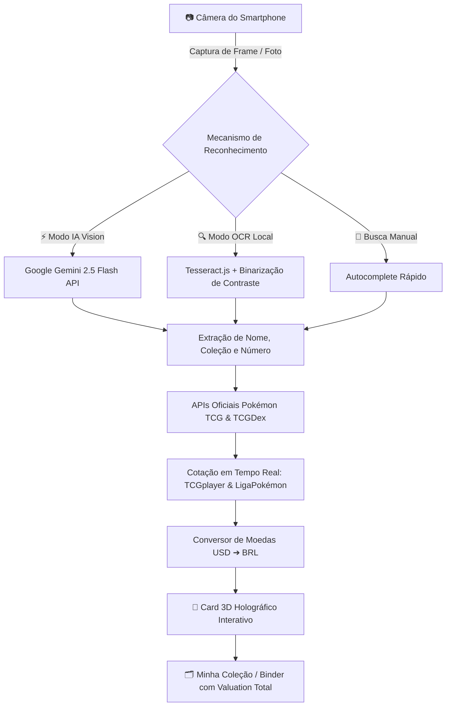

<div align="center">

# ⚡ PokeScan TCG

### 📱 Scanner Inteligente, Reconhecimento Visual e Cotação de Cartas Pokémon em Tempo Real

[](./package.json)
[](./manifest.json)
[](./src/services/geminiVision.js)
[](https://vercel.com)
[](./LICENSE)

<p align="center">
  <b>Aponte a câmera do seu smartphone para qualquer carta Pokémon e veja instantaneamente raridade, coleção, histórico de ataques e valores de mercado em Reais (R$) e Dólares (US$).</b>
</p>

</div>

---

## 🌟 Demonstração das Funcionalidades



---

## ✨ Recursos Principais

### 1. 📷 Scanner Mobile de Alta Performance
- **Enquadramento Preciso**: Moldura calibrada na proporção de cartas Pokémon (63mm x 88mm).
- **Linha Laser & Áudio Pokédex**: Efeito visual de varredura com sintetizador sonoro retro via Web Audio API.
- **Controles de Câmera**: Alternância entre câmera frontal e traseira, controle de lanterna (Flash) para ambientes escuros e zoom rápido 1x/2x.
- **Upload Alternativo**: Suporte para carregar imagens diretamente da galeria do celular.

### 2. 🧠 Reconhecimento Híbrido (IA + OCR)
- **IA Vision (Google Gemini 2.5 Flash)**: Identifica a carta mesmo com reflexos ou em ângulos inclinados, reconhecendo variações especiais, arte alternativa (*Illustration Rare*, *Secret Rare*) e coleções completas.
- **OCR Numérico Local (Tesseract.js)**: Pré-processamento com filtro de alto contraste e binarização para leitura local de códigos como `025/165`, `4/102`, `199/165` sem custo de API.
- **Busca Manual Rápida**: Modal de pesquisa inteligente com tags de atalho (*Charizard*, *Pikachu 151*, *Umbreon VMAX*, *Mew VMAX*, etc.).

### 3. 💎 Card 3D com Brilho Holográfico
- **Efeito 3D Holo Tilt**: A carta responde dinamicamente ao toque na tela, ponteiro do mouse ou giroscópio do celular.
- **Reflexo Prismático**: Simulação de brilho metalizado para cartas Holográficas e Secret Rares.
- **Chuva de Confetes**: Efeito comemorativo ao identificar cartas raras e valiosas (> R$ 150).

### 4. 💰 Painel Financeiro e Cotações em Tempo Real
- **Cotações Multimoeda**: Valores em **Real Brasileiro (R$)**, **Dólar Americano ($)** e **Euro (€)** atualizados com câmbio em tempo real.
- **Detalhamento por Variante**:
  - Preço Normal (Regular)
  - Holofoil (Foil)
  - Reverse Holofoil
  - Menor e Maior valor de mercado
- **Calculadora por Conservação**:
  - *Near Mint (NM)*: 100% do valor de mercado
  - *Lightly Played (LP)*: 85% do valor
  - *Moderately Played (MP)*: 70% do valor
  - *Damaged (DMG)*: 30% do valor
- **Links Diretos de Negociação**: Atalhos para consulta na **LigaPokémon (Brasil)** e **TCGplayer**.

### 5. 🗂️ Gerenciador de Coleção (Binder Virtual)
- **Armazenamento 100% Local**: Dados salvos com persistência no dispositivo (IndexedDB + LocalStorage).
- **Resumo Financeiro Total**: Acompanhe o valor acumulado de todas as suas cartas salvas.
- **Filtros e Ordenação**: Organize por maior valor, menor valor, nome, raridade ou tipo de energia.
- **Exportação & Backup**: Exporte seu catálogo em **JSON** ou **CSV (compatível com Excel)**.

---

## 🔒 Auditoria de Segurança e Privacidade

Este projeto foi construído seguindo rigorosos padrões de segurança:

| Vetor de Segurança | Proteção Implementada |
| :--- | :--- |
| **Prevenção contra XSS** | Todos os dados de entrada, nomes de cartas, links e buscas são sanitizados via `escapeHtml()` antes de qualquer renderização no DOM. |
| **Injeção de Links (Open Redirect)** | Todos os hiperlinks externos validam estritamente o protocolo `https://` via `sanitizeUrl()` e utilizam `rel="noopener noreferrer"`. |
| **Privacidade de Chaves de API** | A chave da API Gemini é armazenada exclusivamente no `localStorage` do dispositivo do próprio usuário, nunca sendo enviada a servidores intermediários. |
| **Proteção de Servidor (Path Traversal)** | O servidor local (`server.js`) possui validação estrita de caminhos (`path.resolve` + restrição de raiz) e bloqueia qualquer tentativa de Directory Traversal com `403 Forbidden`. |
| **Headers de Segurança** | Configurados cabeçalhos `X-Content-Type-Options: nosniff`, `X-Frame-Options: SAMEORIGIN` e `Referrer-Policy: strict-origin-when-cross-origin`. |

---

## 📁 Estrutura do Projeto

```
pokescan/
├── index.html                   # Interface principal responsiva PWA
├── manifest.json                # Manifesto PWA com tema escuro e ícones
├── service-worker.js            # Cache offline para carregamento instantâneo
├── server.js                    # Servidor local Node.js seguro
├── vercel.json                  # Configuração de deploy estático na Vercel
├── package.json
├── vite.config.js
└── src/
    ├── main.js                  # Inicializador e orquestrador da aplicação
    ├── styles/
    │   ├── variables.css        # Paleta Pokédex Holo, fontes e tokens CSS
    │   ├── main.css             # Layout principal, HUD e barra de navegação
    │   ├── scanner.css          # Visor de câmera, moldura guia e botões
    │   ├── card.css             # Estilização 3D da carta, brilho e cotações
    │   ├── collection.css       # Visualização da pasta / coleção
    │   └── modal.css            # Modais de busca, detalhes e configurações
    ├── services/
    │   ├── pokemonApi.js        # Integração pokemontcg.io e TCGDex
    │   ├── geminiVision.js      # Identificação visual por IA (Gemini Flash)
    │   ├── ocrService.js        # OCR local com Tesseract.js e binarização
    │   ├── currencyService.js   # Conversão de câmbio USD/BRL em tempo real
    │   ├── soundService.js      # Efeitos sonoros sintetizados Web Audio
    │   └── storageService.js    # Banco de dados da coleção em IndexedDB
    ├── components/
    │   ├── cameraScanner.js     # Gerenciamento de WebRTC, flash, zoom e crop
    │   ├── holographicCard.js   # Efeito de inclinação 3D com giroscópio
    │   ├── cardDetailModal.js   # Modal com detalhes, preços e ataques
    │   ├── collectionView.js    # Visualização e filtros da coleção
    │   ├── searchModal.js       # Modal de busca rápida
    │   └── settingsModal.js     # Painel de preferências e chaves
    └── utils/
        └── sanitize.js          # Utilitário de segurança contra XSS e links
```

---

## 📱 Como Rodar no Smartphone (iPhone / Android)

### Opção A: Publicar na Vercel (Recomendado) 🚀
1. Envie o projeto para o seu repositório no **GitHub**.
2. Acesse [vercel.com](https://vercel.com) e importe o repositório.
3. Clique em **Deploy** para obter seu link HTTPS público (ex: `https://pokescan.vercel.app`).
4. Abra o link no **Safari (iOS)** ou **Chrome (Android)**.
5. Toque em **"Adicionar à Tela de Início"** para instalar como um aplicativo nativo em tela cheia!

### Opção B: Executar Localmente via Rede Wi-Fi 💻
```bash
# Iniciar o servidor local na porta 3000
node server.js
```
- Acesse no computador: `http://localhost:3000`
- Acesse no celular (mesmo Wi-Fi): `http://<IP_DO_COMPUTADOR>:3000`

---

## 🛠️ Tecnologias Utilizadas

- **Core**: Vanilla JavaScript (ES6+ Modules), HTML5 Semântico, Vanilla CSS Moderno
- **APIs de Dados**: [Pokémon TCG API](https://pokemontcg.io) & [TCGDex Multi-language](https://tcgdex.net)
- **IA Multimodal**: [Google Gemini 2.5 Flash](https://ai.google.dev)
- **OCR**: [Tesseract.js](https://tesseract.projectnaptha.com)
- **Áudio**: Web Audio API (Sintetizador Pokédex nativo sem arquivos de áudio externos)
- **Design**: Glassmorphism, CSS 3D Transforms, DeviceOrientation API, Lucide Icons

---

## ⚖️ Licença e Isenção de Responsabilidade
Distribuído sob a licença MIT. 

*Pokémon e Pokémon TCG são marcas registradas da Nintendo, Creatures Inc. e GAME FREAK Inc. Este aplicativo é um projeto de código aberto desenvolvido para fins educacionais e de coleção, sem qualquer vínculo oficial com a Pokémon Company ou a Nintendo.*
